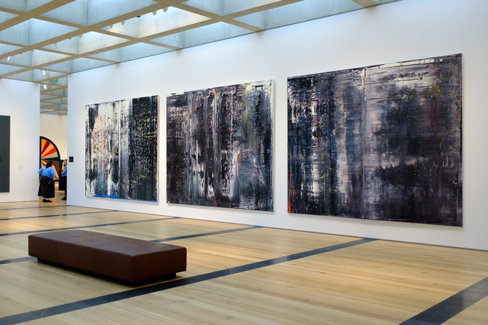

Strange Loop 2015
===
### St Louis, MO

I kept a running list of...

**WORDS AND PHRASES I DO NOT UNDERSTAND**

* Bloom Filter
* Tries
* Reify
* Partitioning a Number
* Referential Transparency

Cool talks:

* [Strange Loops: Capturing Knots With Powerful
Notations](https://www.youtube.com/watch?v=Wahc9Ocka1g) by Kay Ye

    A seriously well executed talk about the history of knot notation with great
    hand-illustrationed slides.

* [Propositions as Types](https://www.youtube.com/watch?v=IOiZatlZtGU) be Philip
Wadler

    A deep dive into the history of types and their relevance to modern computer
    science. Everybody forgets the past.

* [Unconventional Programming with Chemical
Computing](https://www.youtube.com/watch?v=cHoYNStQOEc) by Carin Meier

    Interesting implementations of chemical processes in Clojure

* [Make the Back-End Team Jealous: Elm in
Production](https://www.youtube.com/watch?v=FV0DXNB94NE) by Richard Feldman

    The story of using Elm as the front end to a Rails app and why you would
    want a fully funcitonal, statically typed language running your user
    interfaces.

* [Beating Threads - live coding with real
time](https://www.youtube.com/watch?v=YlRTTzlhquo) by Sam Aaron

    Sam Aaron talks about some of his tricks in implementing SonicPi; keeping
    threads in musical time, hot swapping code into those threads, and cueing and
    syncing.

* [From Protesting to Programming: Becoming a Tech
Activist](https://www.youtube.com/watch?v=gy82S8tjJX8) by Abby Bobé

    An eye-opening journey from growing up on the North Side of Philadelphia to
    learning to code to using her skills to help protestors in Ferguson and
    beyond.

I also drank a lot of great beer at:

* [Schlafly Tap Room](http://schlafly.com/tap-room/)
* [Alpha Brewing Company](http://www.alphabrewingcompany.com/)
* [4 Hands Brewery](http://4handsbrewery.com/)
* [Square One Brewery](http://www.squareonebrewery.com/)

I went to the St. Louis Art Museum (its free!).

Gerhardt Richter is a huge boss.
